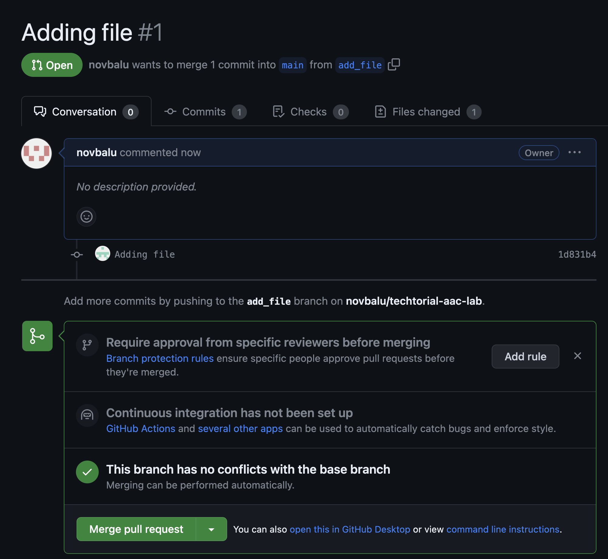

# Lab 1: Introduction to Git

## Goal

Get familiar with Git.


## Code Overview

The repository for this lab ([here](https://github.com/balnovak/techtorial-aac-lab)) contains some sample ACI as Code files that will provision infrastructure onto the DevNet Sandbox ACI simulator. In the following sections, we will make some modifications to the repo step by step and sync all changes with Git.

Note that this lab will only focus on `Git`, subsequent labs will focus on ACI as Code.


## Fork repository
As a first step, we will fork the repository into your own GitHub account. A fork is a copy of a project. Forking a repository allows you to make changes without affecting the original project.

You will find a `Fork` button above the repository. You will be presented with the option about which account the repository should be forked to. In this lab, we will fork it into your personal GitHub account.


## Clone repository

Once the repository has been forked it is time to clone the repository from our repository instance. To do so, go to [GitHub](https://github.com/) and click on the repository you would like to clone. For this lab we will clone the [https://github.com/`<your_user_name>`/techtorial-aac-lab).git](https://github.com/) repository.

You will find a `Code` button above the repository. You will be presented with two options `Clone with SSH` and `Clone with HTTP`. In this lab, we will clone through HTTP. Copy the URL that is shown for HTTP.


Go to a terminal and select the folder where you want to store the repository. Then, clone the Git repository as follows:

```sh
~/prompt> git clone https://github.com/`<your_user_name>`/techtorial-aac-lab.git <folder_name>
```

As an example:

```sh
~/prompt> git clone https://github.com/novbalu/techtorial-aac-lab.git techtorial-aac-labs  
Cloning into 'techtorial-aac-labs'...
remote: Enumerating objects: 3, done.
remote: Counting objects: 100% (3/3), done.
remote: Compressing objects: 100% (2/2), done.
remote: Total 3 (delta 0), reused 0 (delta 0), pack-reused 0
Receiving objects: 100% (3/3), done.
```

You will see that the remote GitHub repository is now available in your local environment in a directory called `techtorial-aac-labs`. You can now open this folder in your IDE. You should see this:


You are now ready to start to make changes to this (local) repository.

## Git remote

As a next step, let's have a quick look at how Git is structured. Git has a working directory, a staging area and a remote repository. So how does this tie together? Let's have a quick look.

After performing the `git clone` operation, you now have a local repository where you can make changes. This local repository is linked to a remote repository, e.g. the one on GitHub. In order to see the relation between both, issue the `git remote` command. The `git remote` command lets you create, view, and delete connections to other repositories.

```sh
~/prompt> git remote -v
origin	https://github.com/novbalu/techtorial-aac-lab.git (fetch)
origin	https://github.com/novbalu/techtorial-aac-lab.git (push)
upstream	https://github.com/balnovak/techtorial-aac-lab.git (fetch)
upstream	https://github.com/balnovak/techtorial-aac-lab.git (push)
```

Note: Depending on your Git configuration, you may not see upstream.

This essentially tells that your local repository is known to Git as 'origin' and the remote repository linked to it can be found at the shown URL. This will become more clear when pushing changes to the remote repository later on in this guide.

## Changing the code

As the repository is now available locally, you can go ahead and make changes to it. Use your IDE to make some changes to the 1_intro_to_git/sudoku.txt file. You can add your name and/or make a few moves.


## Git status

At this point, we have made some changes in our working directory but we have not staged them or sync them to our remote repository. To check this out, use the `git status` command. This command displays the state of the working directory and the staging area. It lets you see which changes have been staged and which haven't.


Go to the terminal and verify the status of your git.

```sh
~/prompt> git status
On branch main
Your branch is up to date with 'origin/main'.

Changes not staged for commit:
  (use "git add <file>..." to update what will be committed)
  (use "git restore <file>..." to discard changes in working directory)
	modified:   1_intro_to_git/sudoku.txt

no changes added to commit (use "git add" and/or "git commit -a")
```

In other words, Git noticed that you made some changes to the variables file and that these changes are not yet staged. This means that we will need to tell Git to stage these files.

## Git status

To view what changes you made use the following command:

```
git diff
```

## Git add

The `git add` command adds a change (or changes) in the working directory to the staging area. It tells Git that you want to include updates to (a) particular file(s) in the next commit. In order to stage the files, go to the terminal and issue the following command:

```sh
~/prompt> git add .
```

Note: here we have added all changed files at once by using the dot notation. You could also stage a single file as follows:

```sh
~/prompt> git add 1_intro_to_git/sudoku.txt
```

As an exercise, perform a `git status` in the terminal and notice what changed. Try to understand the output or ask a lab moderator for more information.

## Git commit

In the previous section, we used `git add` to promote our changes from the working directory to the staging area. The `git commit` command will capture a 'snapshot' of the staged changes.

In order to commit the changes, go to the terminal and issue the following command:

```sh
~/prompt> git commit -m "Played some sudoku"
[main 63d7bf9] Played some sudoku
 1 file changed, 4 insertions(+), 4 deletions(-)
```

As you can see, we provided a commit message through the `-m` parameter. Always try to use a meaningful commit message. It allows other contributors to have an idea of what changes were performed within your commit.

You can view the commit history by using the command:

```
git log
```

## Git push

Now that our changes have been committed, we need to push them to the remote repository on GitHub. The `git push command` is used to upload local repository content to a remote repository. Pushing is how you transfer commits from your local repository to a remote repository. In order to push the changes, go to the terminal and issue the following command:

```sh
~/prompt> git push origin main
```

or just

```sh
~/prompt> git push
```

Note: as previously explained [here](README.md#git-remote), `origin` is a reference to our local repository, while `main` is the name of the remote branch we are pushing our changes to.

You will see the following output (similar):

```sh
~/prompt> git push origin main
Enumerating objects: 7, done.
Counting objects: 100% (7/7), done.
Delta compression using up to 10 threads
Compressing objects: 100% (4/4), done.
Writing objects: 100% (4/4), 381 bytes | 381.00 KiB/s, done.
Total 4 (delta 3), reused 0 (delta 0), pack-reused 0
remote: Resolving deltas: 100% (3/3), completed with 3 local objects.
To https://github.com/novbalu/techtorial-aac-lab.git
   b997c25..63d7bf9  main -> main
```

It will tell you that the local repository is now synced with the remote repository on GitHub.

## Using Feature Branches

In the above sections we made changes to our local repository and we committed them directly to our `main` branch. This might be an option when you are the only developer of a small project but it is certainly not considered a best practise as it will create some issues like colliding commits when multiple people work on the same file etc...

If you are working on a larger project with multiple contributors, a more convenient way would be to create `Feature Branches`. The core idea behind the Feature Branch Workflow is that all feature development (or bug fix or ...) should take place in a dedicated branch instead of the main branch. Only when your feature (or bug fix) is finished and properly tested (or validated by peers), you will merge that feature branch to the main branch.

Let's see how this is done in the next sections.

## Git branch

To give some context, we will first have a look at our branches as it will be useful for the next sections. The `git branch` command is helpful in this context as it lets you create, list, rename, and delete branches. In your terminal, issue the following command:

```sh
~/prompt> git branch
```

You will see we have one local branch called 'main'.

Note: in case you want to see your remote branches, use the `git branch -r` command (or `git branch -a` if you want to see all local and remote branches at once).

## Create a feature branch

Next, let's create a branch. Imagine you want to fix a bug in your code or you want to work on a specific feature of your application. As mentioned above, it's a good idea to make these changes in a seperate branch. So let's create a seperate branch. Create the branch as follows:

```sh
~/prompt> git checkout -b add_file
Switched to a new branch 'add_file'
```

Now, use `git branch` to verify the local branches and remote branches. You will notice that we have a local branch called 'add_file' while we still have only one 'main' remote branch. As an exercise, explain why we have two branches locally but only one remote branch.

## Make changes to feature branch

Create a new file. E.g.
```
~/prompt> cd 1_intro_to_git 
~/prompt> echo "Hello Git" > hello.txt
```

This file is now untracked by Git. You can verify it via `git status` and `git diff`. 
Next, perform the steps you are already familiar with:

```sh
~/prompt> git add hello.txt

~/prompt> git commit -m "Adding file"
[add_file 1d831b4] Adding file
 1 file changed, 1 insertion(+)
 create mode 100644 1_intro_to_git/hello.txt

~/prompt> git push
Enumerating objects: 6, done.
Counting objects: 100% (6/6), done.
Delta compression using up to 10 threads
Compressing objects: 100% (3/3), done.
Writing objects: 100% (4/4), 422 bytes | 422.00 KiB/s, done.
Total 4 (delta 1), reused 0 (delta 0), pack-reused 0
remote: Resolving deltas: 100% (1/1), completed with 1 local object.
remote: 
remote: Create a pull request for 'add_file' on GitHub by visiting:
remote:      https://github.com/novbalu/techtorial-aac-lab/pull/new/add_file
remote: 
To https://github.com/novbalu/techtorial-aac-lab.git
 * [new branch]      add_file -> add_file
branch 'add_file' set up to track 'origin/add_file'.
```

Note that we are pushing the changes to the 'add_file' branch (instead of the main branch we used previously).

Remember that in the [previous section](README.md#create-a-feature-branch), we only had one remote branch? Let's check now if a remote branch was created:

```sh
~/prompt> git branch -r
```

You should see two remote branches now, namely 'main' (origin/main) and 'add_file' (origin/add_file). Let's also verify also on the GitHub site:


You will find indeed the two branches in GitHub as well.

## Git merge

We now have a situation where we have a main branch (with no hello.txt file) and a feature branch (with the file). To verify this you could go to the GitHub repository and check the files on the main branch using the GitHub web UI.

Next, switch between the 'main' branch and the 'add_file' branch. You will notice that when switching between the branches the new file will appear.

When our feature (or bug fix) is completed, we can go ahead and merge these changes in the main branch. This means that changes we made in the 'add_file' branch will be merged with the 'main' branch. Note that a `Git merge` action is sometimes also called a `Git pull request`.

Click on `Pull requests` > `New pull request`.


Then create a new PR from the add_file branch.


This will make a new merge request. Click on the button `Create pull request`. You will then get the following screen:




Git will now verify if the changes can be merged into the main branch (see note 1 below). This is also an opportunity for the owner of the repository to review your code contribution and ask you for clarifications or ask for additional changes before allowing this feature branch to be merged into the main branch (see note 2 below).

Note 1: while this is an easy example and everything works smoothly, sometimes this step will lead into merge conflicts. This happens for instance when multiple people have changed the same line in the same file. Git will allow you to fix these conflicts so the merge can be completed successfully. This is outside the scope of this lab though.

Note 2: in case there should still be issues, you could change the code again and follow the previous steps (`git add`, `git commit` and `git push origin add_file`) again. GitHub will have an overview of all your commits and once the main contributor approves, it will merge all these commits into the 'main' branch.

Click on the `Merge pull request` button.

Git will now label this as `Merged` (see top of the screen) and will mention that our changes were merged into the main branch and you will have an option to delete the source branch (add_file). Go ahead and delete it by .

To verify, go back to the GitHub repository and verify that you only have the 'main' branch. Look again and verify that the new file is present.

## Git pull

In the previous section, we have successfully merged our 'add_file' branch into the 'main' branch. Next, perform a `git branch` in your terminal.

```sh
~/prompt> git branch
```

This will show two branches: 'main' and 'add_file'. Wait a minute... didn't we just mention in the previous section that the branch 'add_file' was deleted?

The truth is the feature branch 'add_file' was deleted only in the remote repository but not in the local repository. We need to bring back our local repository in sync with the remote repository. Luckily Git makes this very easy for us by using the `git pull` command. The `git pull command` is used to fetch and download content from a remote repository and immediately update the local repository to match that content.

```sh
~/prompt> git checkout main
~/prompt> git pull
Updating 63d7bf9..6d71cc2
Fast-forward
 1_intro_to_git/hello.txt | 1 +
 1 file changed, 1 insertion(+)
 create mode 100644 1_intro_to_git/hello.txt
```

Note: we first moved back to the 'main' branch as this is where we want to pull the changes to.

Verify now with `git branch`. You will still see the two branches. This is simply because we have pulled the changes from the remote repository to our local repository but we have not deleted the feature branch yet. Let's do this next:

```sh
~/prompt>  git branch -d add_file
Deleted branch add_file (was 1d831b4).
```

We have now successfully created, reviewed and merged the feature branch and both our local and remote repositories are fully in sync, ready for you to fix the next bug or add functionality by adding a new feature.
