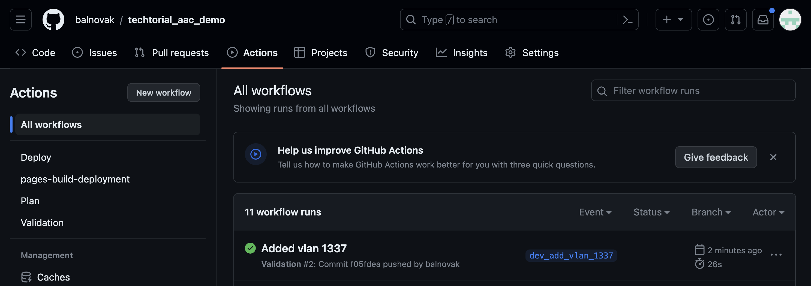
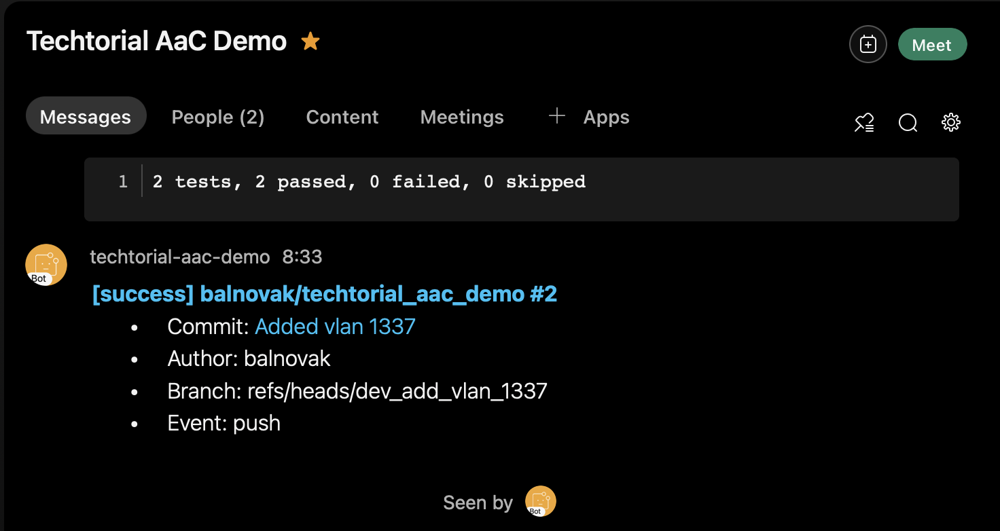
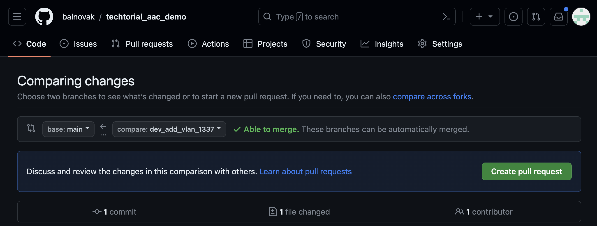
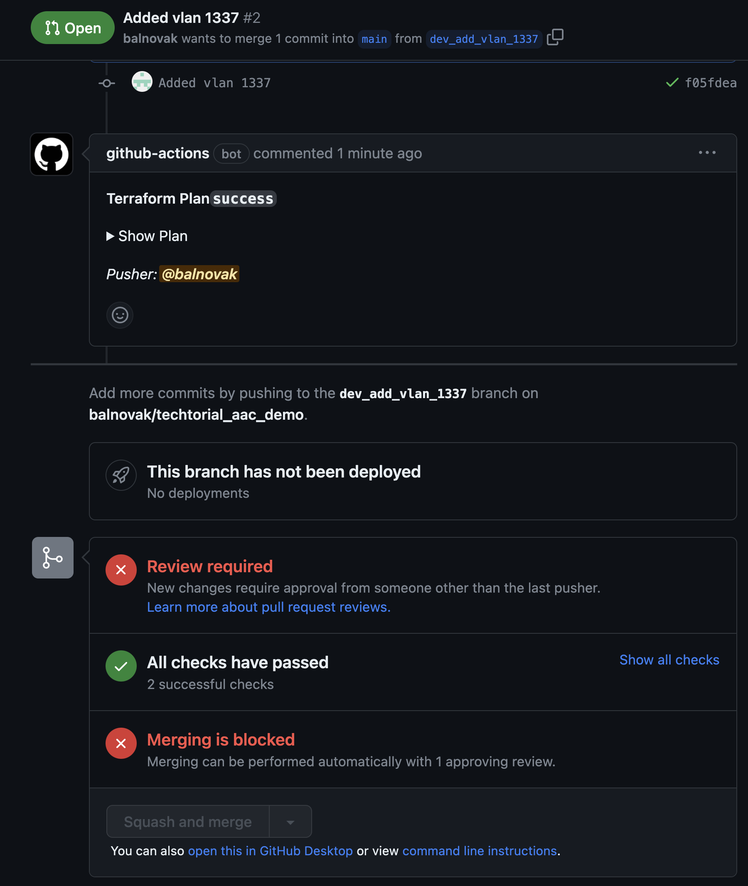
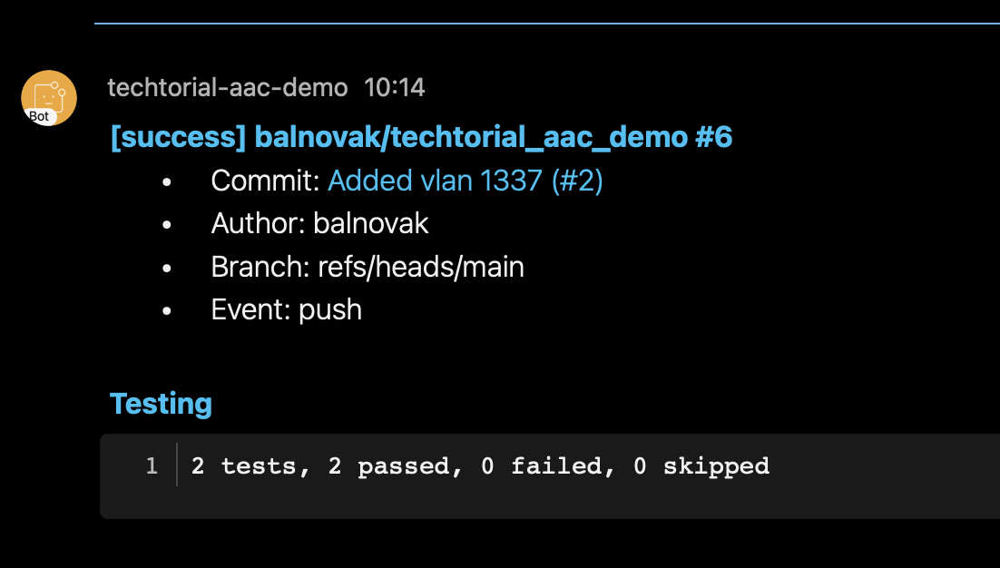
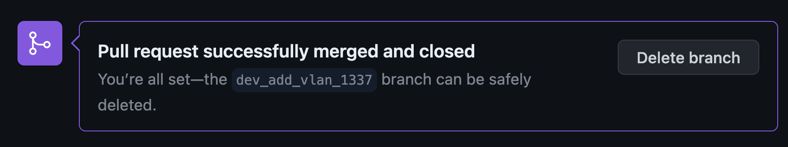

# Trying out an ACI as Code CICD Pipeline


## Goal

In this lab we'll explore how a contributor can work with ACI as Code.
The goal of this lab is to focus on this workflow. The implementation details are going to be covered in the next lab.


## Lab Overview and Credentials

We will utilize the following GitHub repository:
https://github.com/balnovak/techtorial_aac_demo

The pipeline is implemented using GitHub Actions and the test results are made 
available via GitHub Pages. There is a Webex space dedicated for the pipeline 
notifications. In order to join the space open an Issue for it in the repo or 
drop an email to: balnovak@cisco.com.

As before, you will be able to access the APIC on the following address:

- Sandbox ACI simulator: https://sandboxapicdc.cisco.com

The ACI simulator can be accessed using the following credentials.

|            | Username | Password |
| ---------- | -------- | -------- |
| ACI Sim    | admin    | !v3G@!4@Y |


## Clone the Git repository

First, clone the following Git repo:

```
~/prompt> git clone https://github.com/balnovak/techtorial_aac_demo.git
```

You may find it familiar from the Techtorial demo.
Open up the folder in your favorite IDE (e.g. Visual Studio, PyCharm...). Take some time and examine the code structure.


## Try pushing to the main branch

By default you are on the main branch after cloning. You can verify this by the following command:

```shell
~/prompt> git status
On branch main
Your branch is up to date with 'origin/main'.

nothing to commit, working tree clean
```

Let's try and push a change to main.

```shell
~/prompt> echo "test" > test.txt
~/prompt> 
~/prompt> git status
On branch main
Your branch is up to date with 'origin/main'.

Untracked files:
  (use "git add <file>..." to include in what will be committed)
	test.txt

nothing added to commit but untracked files present (use "git add" to track)
~/prompt> git add .
~/prompt>
~/prompt> git commit -m "Testing main"
[main 76d43b9] Testing main
 1 file changed, 1 insertion(+)
 create mode 100644 test.txt
~/prompt>
~/prompt> git push
Enumerating objects: 3, done.
Counting objects: 100% (3/3), done.
Delta compression using up to 10 threads
Compressing objects: 100% (2/2), done.
Writing objects: 100% (2/2), 235 bytes | 235.00 KiB/s, done.
Total 2 (delta 1), reused 0 (delta 0), pack-reused 0
remote: Resolving deltas: 100% (1/1), completed with 1 local object.
remote: error: GH006: Protected branch update failed for refs/heads/main.
remote: error: Changes must be made through a pull request. 2 of 2 required status checks are expected.
To https://github.com/balnovak/techtorial_aac_demo.git
 ! [remote rejected] main -> main (protected branch hook declined)
error: failed to push some refs to 'https://github.com/balnovak/techtorial_aac_demo.git'
```

We didn't succeed in pushing to the main branch. We'll have to do it another way. For now, let's clean up the local main branch. The following command deletes the last local commit on our branch. Use it carefully!

```shell
~/prompt> git reset --hard HEAD~1
```

We didn't succeed in pushing to the main branch, because it is protected. In order to make changes to it, we will need to create a new development branch and push to that. Once our change is validated on our develepment branch, we can raise a pull request and only then - once the Plan workflow is passed - can we merge our change to main. Let's see how.


## Create a Development branch


We'll start by creating a development branch. Give it a descriptive name. Since we'll add a new VLAN in this lab as an example, we'll call the branch `dev_add_vlan_<id>`. Pick an ID number between 1 and 4094, that's not yet used. (To see which VLANs are already in use, check the config in the data/ directory.)
Since there are multiple people working on the same code base, it is best to pick a new ID, so that you can identify your own change. We'll add a comment with our name for the same reason.
```shell
~/prompt> git checkout -b dev_add_vlan_1337
```


## Edit the config and push to GitHub

Next, let's edit our configuration. Open the `techtorial_aac_demo/data/tenant_Techtorial.nac.yaml` file and add a new bridge domain (without a subnet) and a new endpoint group following the network-centric model that you can see in the file already.

In our example:
```yaml
---
apic:
  tenants:
    - name: Techtorial

      description: "AaC demo tenant by balnovak"

      vrfs:
        - name: VRF1
        - name: VRF2

      bridge_domains:
        # Network-centric BDs
        - name: VLAN101
          vrf: VRF1
          subnets:
            - ip: 10.1.0.1/24
        - name: VLAN102
          vrf: VRF1
          subnets:
            - ip: 10.1.1.1/24
        - name: VLAN103
          vrf: VRF1
          subnets:
            - ip: 10.1.2.1/23
        - name: VLAN104
          vrf: VRF1
          subnets:
            - ip: 10.1.4.1/23
        # Added by balnovak
        - name: VLAN1337
          vrf: VRF1

      application_profiles:
        - name: DEV
          endpoint_groups:
            # Network-centric EPGs
            - name: VLAN101
              bridge_domain: VLAN101
            - name: VLAN102
              bridge_domain: VLAN102
            - name: VLAN103
              bridge_domain: VLAN103
            - name: VLAN104
              bridge_domain: VLAN104
            # Added by balnovak
            - name: VLAN1337
              bridge_domain: VLAN1337
```

For your reference, when editing the yaml files, you can see the data model documentation here:
https://developer.cisco.com/docs/nexus-as-code/#!data-model-aci/aci

Let's save and confirm our changes.

```shell
~/prompt> git status
On branch dev_add_vlan_1337
Changes not staged for commit:
  (use "git add <file>..." to update what will be committed)
  (use "git restore <file>..." to discard changes in working directory)
	modified:   data/tenant_Techtorial.nac.yaml

no changes added to commit (use "git add" and/or "git commit -a")
~/prompt> 
~/prompt> git diff  
diff --git a/data/tenant_Techtorial.nac.yaml b/data/tenant_Techtorial.nac.yaml
index ee5a7b5..eefb91a 100644
--- a/data/tenant_Techtorial.nac.yaml
+++ b/data/tenant_Techtorial.nac.yaml
@@ -26,6 +26,9 @@ apic:
           vrf: VRF1
           subnets:
             - ip: 10.1.4.1/23
+        # Added by balnovak
+        - name: VLAN1337
+          vrf: VRF1
 
       application_profiles:
         - name: DEV
@@ -38,4 +41,6 @@ apic:
               bridge_domain: VLAN103
             - name: VLAN104
               bridge_domain: VLAN104
-
+            # Added by balnovak
+            - name: VLAN1337
+              bridge_domain: VLAN1337
```

Then let's create a commit and push it.

```shell
~/prompt> git add . 
~/prompt> git commit -m "Added vlan 1337"
[dev_add_vlan_1337 f05fdea] Added vlan 1337
 1 file changed, 6 insertions(+), 1 deletion(-)
~/prompt> 
~/prompt> git push                       
Enumerating objects: 7, done.
Counting objects: 100% (7/7), done.
Delta compression using up to 10 threads
Compressing objects: 100% (4/4), done.
Writing objects: 100% (4/4), 419 bytes | 419.00 KiB/s, done.
Total 4 (delta 2), reused 0 (delta 0), pack-reused 0
remote: Resolving deltas: 100% (2/2), completed with 2 local objects.
remote: 
remote: Create a pull request for 'dev_add_vlan_1337' on GitHub by visiting:
remote:      https://github.com/balnovak/techtorial_aac_demo/pull/new/dev_add_vlan_1337
remote: 
To https://github.com/balnovak/techtorial_aac_demo.git
 * [new branch]      dev_add_vlan_1337 -> dev_add_vlan_1337
branch 'dev_add_vlan_1337' set up to track 'origin/dev_add_vlan_1337'.
~/prompt> 
```

We have successfully pushed the commit to origin (GitHub) onto our dev branch.
There is a GitHub actions workflow triggered automatically that validates our change. To see this workflow click on `Actions`.



You can also click on the workflow and see the run details (terminal output).

Once the job finishes you will see a Webex notification with the results.



The validation should be successful. If it's not, you'll see the reason of failure as well. In this case you should fix whatever is wrong and push a new commit with the fix to the same dev branch.

An example of such a failure has been presented on the Techtorial demo:


## Create a Pull Request

Once the validation passed, you can decide that the change is ready to be merged with the main branch. Open a PR. A new workflow is triggered: Plan.



The run's result is added to the PR as a comment. Once the plan runs successfully, ask for a review.




## Merge Pull Request

Once the code owner reviewed the changed and merged it, the PR can be merged.

A new workflow is triggered: `Deploy`.
You'll also get a Webex notification about the results.



The link with the test results only refreshes once the `pages build and deployment` workflow finishes. (This is the GitHub Pages integration.)

You can decide to delete the dev branch.




## Verify results

Check that your change is reflected on the sandbox APIC.

