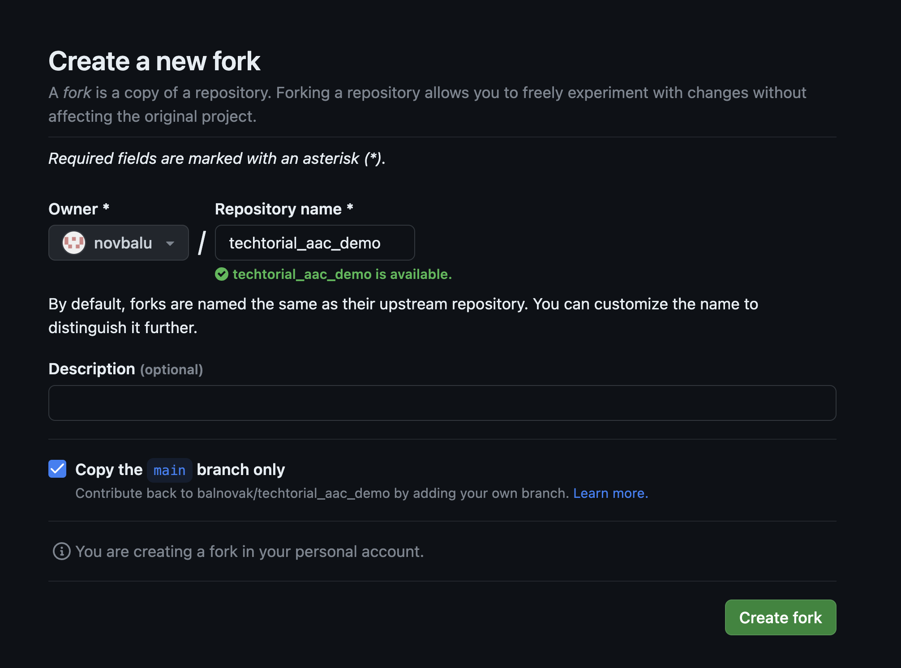
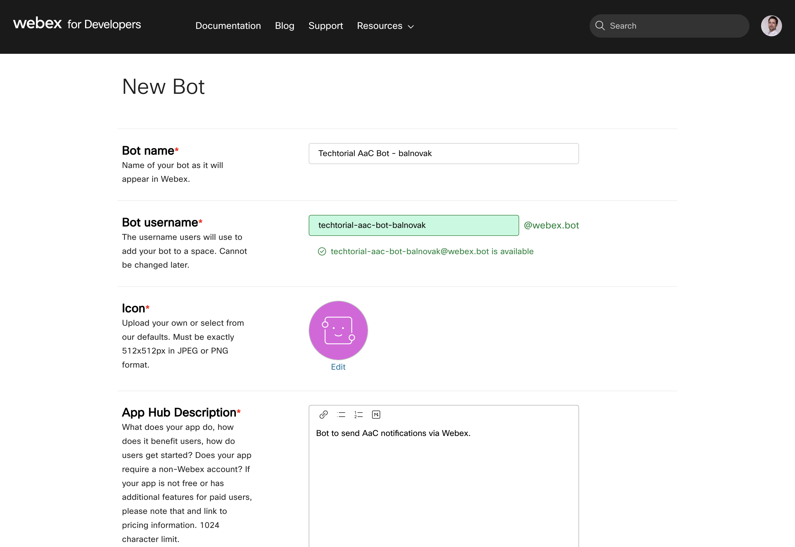
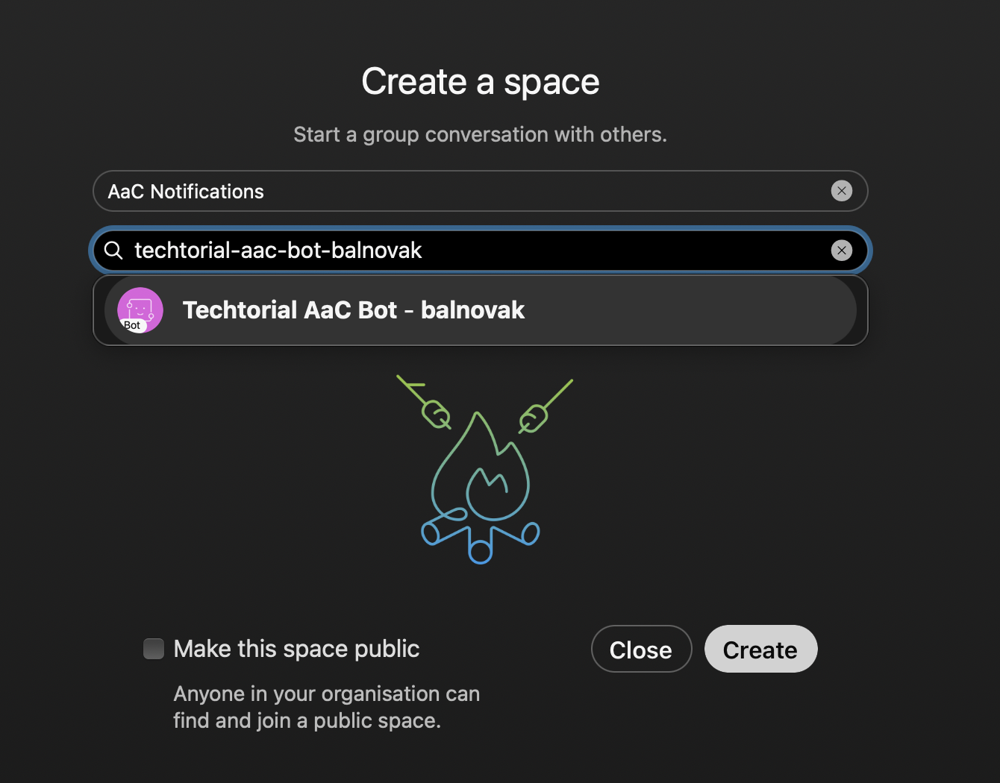
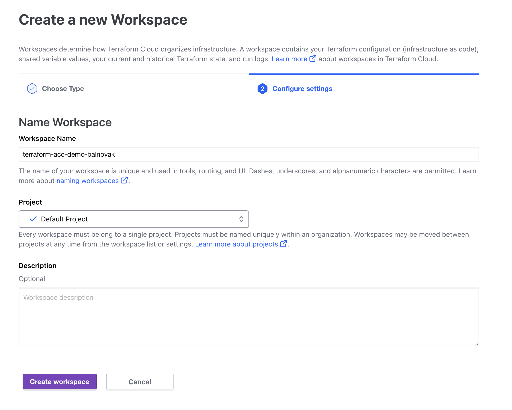
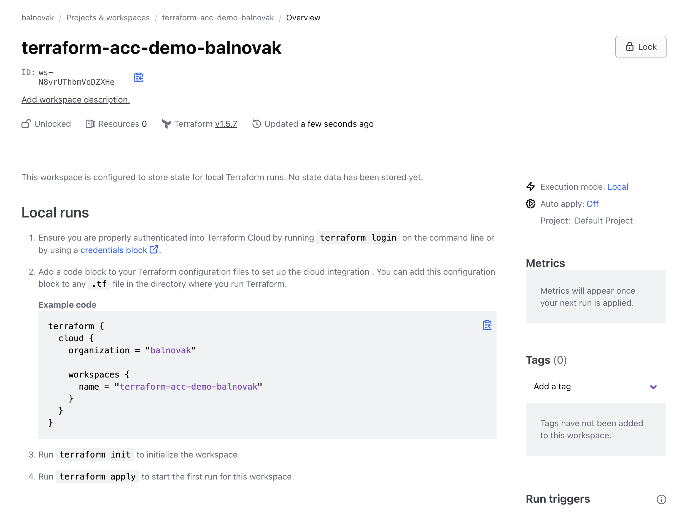
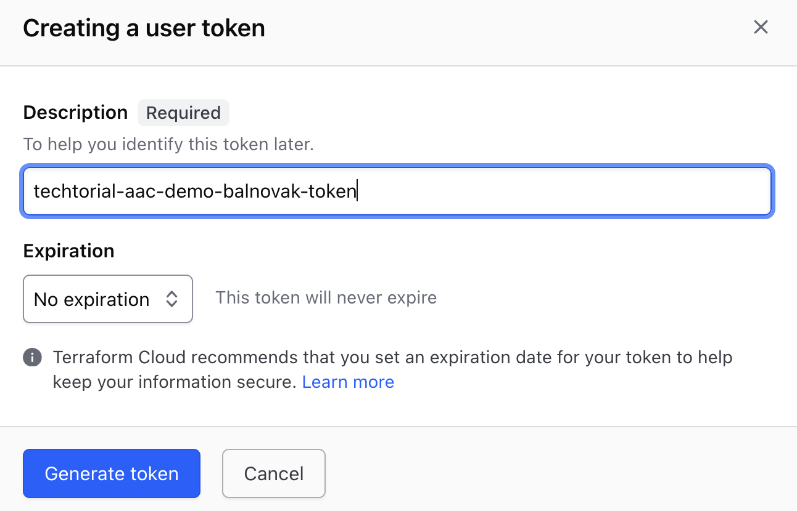
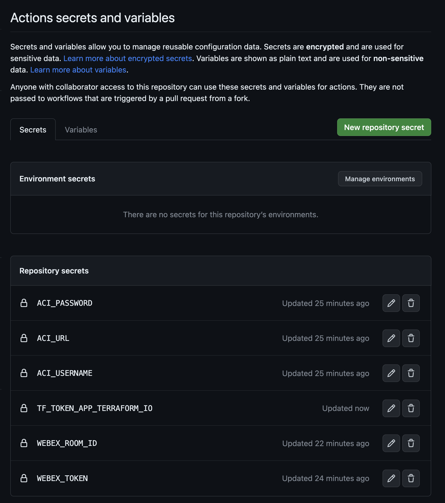
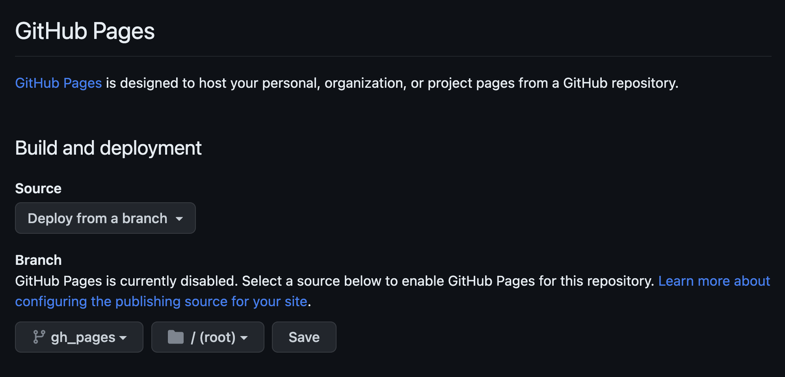
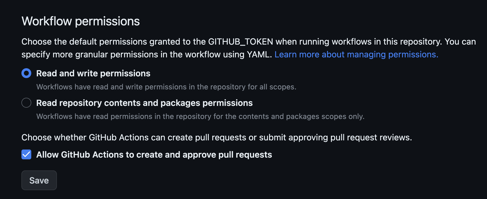

# Building the CICD pipeline (optional)

## Goal

In this lab we'll fork the repository that we've seen in the previous lab and replicate it's GitHub pipeline. 
You'll see how each step is configured. Keep in mind that this is just one possible pipeline, we could achieve the same with other tools as well.

## Lab Overview and Credentials

We will fork the following GitHub repository:
https://github.com/balnovak/techtorial_aac_demo

The pipeline is implemented using GitHub Actions and the test results are made 
available via GitHub Pages.

As before, you will be able to access the APIC on the following address:

- Sandbox ACI simulator: https://sandboxapicdc.cisco.com

The ACI simulator can be accessed using the following credentials.

|         | Username | Password  |
| ------- | -------- | --------- |
| ACI Sim | admin    | !v3G@!4@Y |


## Fork the Git repository

First, fork the following Git repo:
https://github.com/balnovak/techtorial_aac_demo




## Add secrets

We'll add our environment variables as GitHub secrets. Navigate to `Settings` > `Secrets and variables` > `Actions`.
Add the following variables as secrets:


| Secret name  | Secret value                    |
| ------------ | ------------------------------- |
| ACI_USERNAME | admin                           |
| ACI_PASSWORD | !v3G@!4@Y                       |
| ACI_URL      | https://sandboxapicdc.cisco.com |


## Preparing Webex Notifications

### Create a Webex Bot

This lab has an integration with Webex that is used to send notifications to indicate the status of each pipeline build. To do this you will need to create a Webex Bot that will post these notifcations.
Head to <https://developer.webex.com> and login with your Cisco/Webex credentials. Select `Start Bulding Apps` and `Create a Bot`.



Fill out all required fields. **MAKE SURE** to use a unique bot username.

Once finished, click `Add Bot` and your Webex bot will be created. You will receive a `Bot Access Token`. Copy and save this token somewhere.

### Create a Webex Space

Next, we will create a Webex space. In the Webex app, click the `+` icon and select `Create Space`.



**MAKE SURE** to use a unique name for your space. Then add the bot we created earlier as a member to this space.

Say hello to the bot! :) No, seriously - you will need to send a message to this space for the next step to work.


### Retrieve Room ID

The GitHub pipeline will need to know the room ID in order to be able to send messages to it. So in the section, we will retrieve the room ID for the room we just created. There are multiple ways to do this (e.g postman, python, CURL...). In this lab guide, we will use CURL.

```shell
~/prompt> curl -L -X GET 'https://api.ciscospark.com/v1/rooms' -H 'Authorization: Bearer <BEARER>' | json_pp -json_opt pretty,canonical
```

In the above command, replace the `<BEARER>` value with Bot Access Token value that you received when the Webex Bot was created. If all went well, you will receive a response containing a JSON body. We will use the `id`, so copy and save it somewhere.

```json
{
   "items" : [
      {
         "created" : "2023-09-27T16:39:27.703Z",
         "creatorId" : "***",
         "id" : "***",
         "isLocked" : false,
         "isPublic" : false,
         "isReadOnly" : false,
         "lastActivity" : "2023-09-27T16:40:05.269Z",
         "ownerId" : "***",
         "title" : "AaC Notifications",
         "type" : "group"
      }
   ]
}

```

### Add the Bot Access Token and the Webex Room ID to the secrets

Add the following secrets, just like before:

| Secret name   | Secret value        |
| ------------- | ------------------- |
| WEBEX_TOKEN   | \<Bot Access Token> |
| WEBEX_ROOM_ID | \<Webex Room ID>    |
## Create Terraform Cloud Workspace

Terraform spports multiple different backends for storing the statefile. In the previous labs we used the local filesystem to store the statefile, but in this lab will we use Terraform Cloud.

### Create Terraform Cloud Account

We will start by registering a Terraform Cloud Account using the free tier. If you already have an account, then you can skip this step.

Open [http://app.terraform.io](https://app.terraform.io) in your browser and create a free account and log in.

### Create Organisation

If you just have created your Terraform Cloud account will you automatically get prompted to create an organisation. If you already have an acocunt, then you can choose to either create a new organisation or reuse an existing one.

Organisations in Terraform Cloud are privately shared spaces for teams to collaborate in. Inside an organisation can you have one or more workspaces, which we will create in the next section.

Go ahead and create an organisation for this lab in case you do not have one that you can re-use.

With the organisation created are the next step to configure a workspace within Terraform Cloud.

### Create Workspace

Navigate to `Manage` > `Projects & workspaces` > `New` > `Workspace`.

Terraform Cloud supports different types of workspaces depending on how Terraform is invoked. In our case will we be involking Terraform from the cli, so select `CLI-driven workflow`.



Give the workspace a name and click `Create Workspace`.

Once the workspace is created will a screenshot smilar to the one below.

We'll then need to select (on the right) `Execution mode` > `Execution Mode` > `Custom` > `Local`. Then `Save Settings`.



Add the shown backend configuration to the `main.tf` located in the `techtorial_aac_demo` GitHub repository. This will instruct terraform to use Terraform Cloud as the backend for the statefile.

### Create API Token

The last step within Terraform Cloud is to create an API token for your user account. Access your `User Settings` and click on `Tokens` to create a new API token.

Give the token a meaning full name and click on `Generate Token`.



You will then be displayed the API token which you could copy as we will be using this in the next step.


### Add the Terraform Cloud Token to the secrets

Add the Terraform Cloud Token to the secrets, just like before:

| Secret name               | Secret value      |
| ------------------------- | ----------------- |
| TF_TOKEN_APP_TERRAFORM_IO | \<TF Cloud Token> |


When finished, you should see the following secrets added to your repository:



## Setting up GitHub Pages

GitHub Pages is a static site hosting service that allows you to make an html file from the GitHub repository available via a `https://<user_name>.github.io/<repo_name>/` address. In our example, it'll be `https://balnovak.github.io/techtorial_aac_demo/`.

Since the test output file is an html file (`log.html` within the `test_results` directory), we can use this service to publish the test results for demonstrative purposes.

First, create a branch, called `gh_pages` and completely remove all files from it.
(Alternatively you can create it from balnovak/techtorial_aac_demo:gh_pages).

We will copy the `log.html` file here using a workflow (`Deploy`). You can examine the workflow definition file `.github/workflows/deploy.yml` to see how it is done. (Hint: it's in step `Publish Github Pages`).

Navigate to `Settings` > `Pages` and enable the service.

Then select `Deploy from a branch` as source and `gh_pages` > `/ (root)` as branch. Hit save.



Under `Settings` > `Actoins` > `General` > `Workflow permissions` allow `Read and write permissions`.



This is needed so that the `github-pages` bot can write `log.html` to the `gh_pages` branch. 

As a last step, modify the `.ci/render-wx.py` file so that it links to the correct test results. In our example:

```Py
TEST_OUTPUT = """\n[**Testing**](https://novbalu.github.io/techtorial_aac_demo/log.html)
```

## Checking the pipeline

When you push the change above to main, you should see the Deploy workflow triggered. If it runs without failing and you receive the Webex notification - well, then congratulations! You have successfully set up the pipeline.

As a reward you may try the steps we followed in the previous lab or play around as your heart desires.

